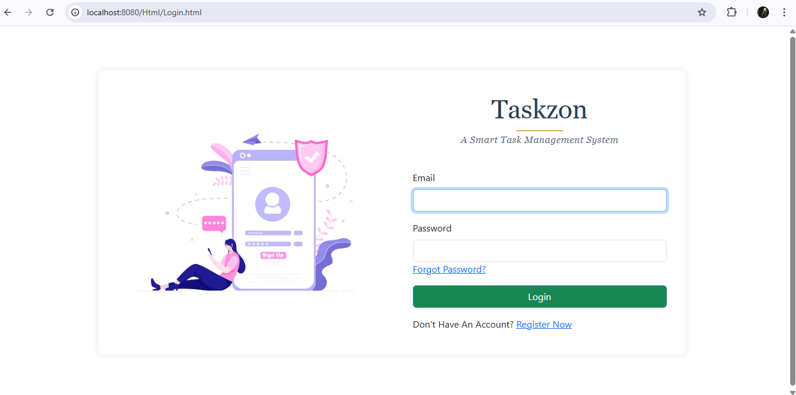

# 🚀 Taskzon – A Smart Task Management System

**Taskzon** is a full-featured task management web application designed to simplify how users and admins collaborate on tasks. It includes role-based dashboards, task status tracking, admin approval workflows, and overdue detection via cron jobs — all powered by Java Spring Boot.

---

## ✅ Features

### 👤 User Functionality
- User Registration and Login with session-based authentication
- Forgot Password functionality with email-based recovery and secure password reset
- Dashboard showing an overview of tasks (ToDo, In Progress, etc.)
- Create Tasks and assign Admin for approval
- Mark Tasks as `Done`, triggering Admin approval workflow
- Tasks marked as `Redo` by Admin are shown with remarks
- Automated cron job checks for overdue tasks and updates dashboard
- Profile management: update name, email, phone number, and profile image
- Secure Logout

### 🛡️ Admin Functionality
- Secure Admin Login and password update
- Admin Dashboard showing global task and user stats
- Create, assign, edit, and delete tasks for any registered user
- Task Category management (Add, Edit, Delete)
- View and manage all registered users (View/Delete)
- Approve or send back tasks for user revision with remarks
- Admin profile management and Logout

---

## ⚙️ Tech Stack

- **Programming Language**: Java
- **Framework**: Spring Boot
- **Database**: Oracle with JPA and Hibernate
- **Frontend Technologies**: HTML, CSS, Bootstrap, jQuery
- **Email Integration**: Gmail SMTP for password recovery
- **Scheduling**: Cron Jobs for overdue task detection
- **Authentication**: Session-based login with role-based access control

---

## 🛠️ Setup Instructions

### 1️⃣ Prerequisites

- Java 17 or higher
- Maven
- Oracle
- Gmail account (for email functionality)
- IDE like IntelliJ IDEA or Eclipse

---

### 2️⃣ Clone the Repository

```bash
git clone https://github.com/sameerlandge19/Taskzon.git
cd Taskzon
```

---

### 3️⃣ Database Setup

- Create a Oracle database named:

```sql
CREATE USER "username" IDENTIFIED BY "password";
```

- Update `application.properties` file:

```properties
spring.datasource.url=jdbc:oracle:thin:@localhost:1521:orcl
spring.datasource.username=my_username
spring.datasource.password=my_password
spring.jpa.hibernate.ddl-auto=update
```

---

### 4️⃣ Email Configuration (Gmail SMTP)

- Enable 2-Step Verification on your Gmail
- Generate an **App Password**
- Add to `application.properties`:

```properties
spring.mail.host=smtp.gmail.com
spring.mail.port=587
spring.mail.username=your_email@gmail.com
spring.mail.password=your_app_password
spring.mail.properties.mail.smtp.auth=true
spring.mail.properties.mail.smtp.starttls.enable=true
```

---

### 5️⃣ Run the Application

Build the project:

```bash
mvn clean install
```

Run it:

```bash
mvn spring-boot:run
```

---
## 📸 Screenshots
###  Login


###  SignUp


###  Dashboard


###  Assign Task


###  Employee List


###  Review And Appproval


###  Action


###  Category


###  Admin Profile


###  Action


###  My Tasks


###  Edit Tasks


###  Pending Approval


###  OverDue Task


###  User Profile
